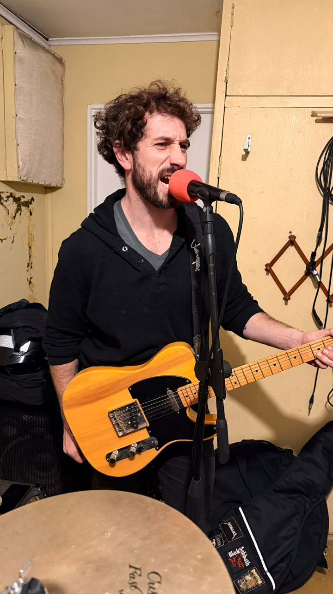
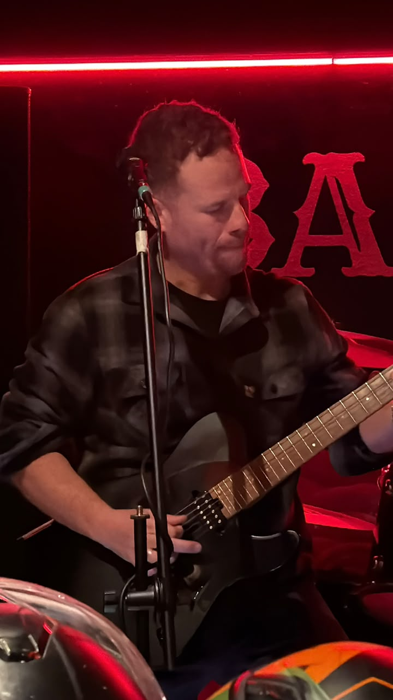
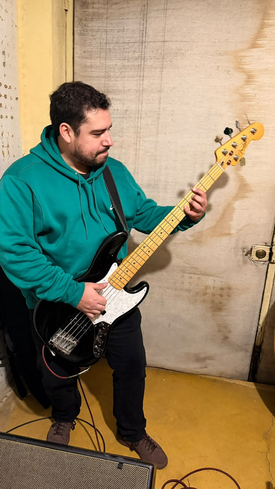
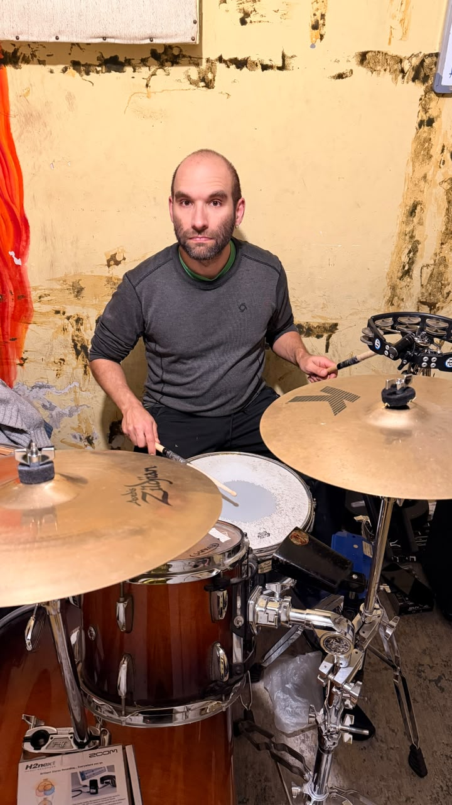

::: {.page-banner}
# La Banda

::: {.page-banner-sub}
Cuarteto Eléctrico en Vivo &middot; Santiago, Chile
:::
:::

::: {.container}

Cuatro integrantes, una misma pasión por el heavy rock y el grunge de los 90 y 2000.

::: {.band-grid}
::: {.band-card}

[Voz Principal]{.role}\
[Luciano Panizza]{.name}\
["Lu"]{.nickname}
:::

::: {.band-card}

[Guitarra Eléctrica]{.role}\
[Daniel Rojas]{.name}\
["Dan"]{.nickname}
:::

::: {.band-card}

[Bajo]{.role}\
[Bautista Soto]{.name}\
["Bau"]{.nickname}
:::

::: {.band-card}

[Batería]{.role}\
[Alonso Arriagada]{.name}\
["Bondo"]{.nickname}
:::
:::

:::
