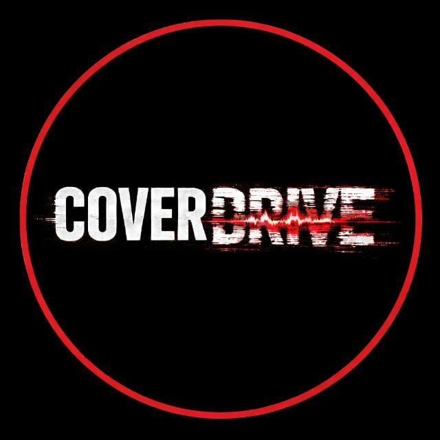
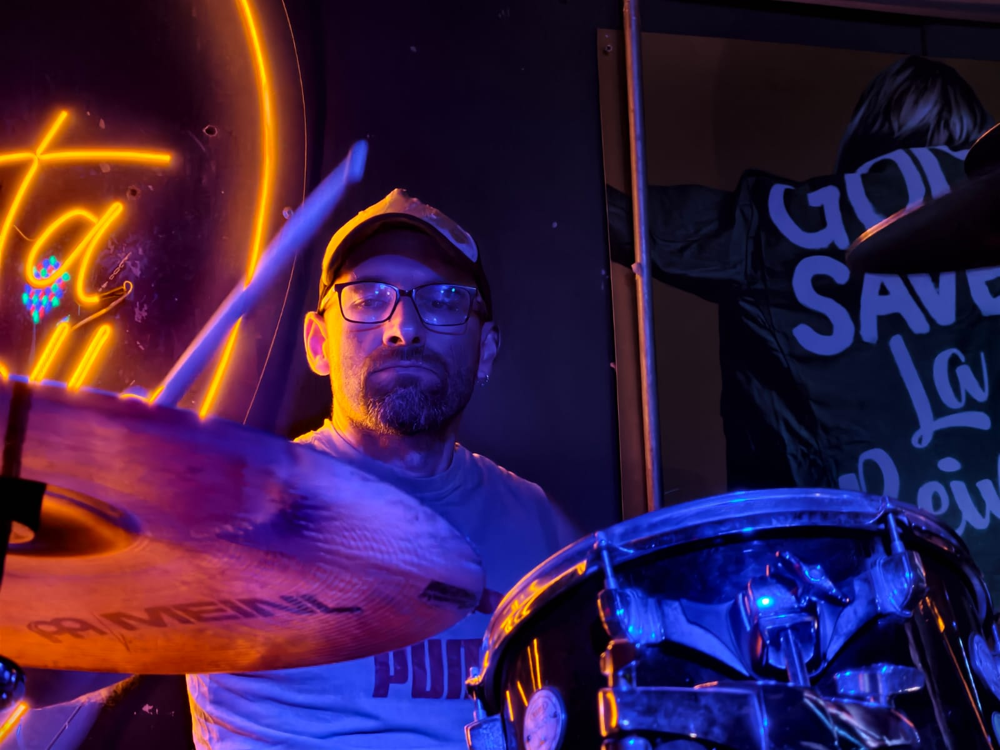

::: {.hero}

# [COVER]{.cd-white}[DRIVE]{.cd-red} {.hero-title}

::: {.hero-tagline}
Heavy Rock &middot; Rock Alternativo &middot; Grunge — Santiago, Chile
:::

::: {.hero-cta}
[Ver Repertorio](repertorio.qmd){.btn-cd}
[Contrataciones](contacto.qmd){.btn-cd .btn-cd-outline}
:::
:::

::: {.container}

## Resumen Ejecutivo

**Coverdrive** es una banda chilena de covers de heavy rock enfocada en revivir con máxima fidelidad, garra y potencia los grandes clásicos del género de los años 90 y 2000. Formada por cuatro músicos —voz, guitarra eléctrica, bajo y batería—, la agrupación destaca por la contundencia de su sonido en vivo, una cuidada ejecución técnica y una puesta en escena de alta energía diseñada para conectar de inmediato con el público.

::: {.quick-facts}
::: {.quick-fact}
[Origen]{.qf-label}\
[Santiago, Chile]{.qf-value}
:::

::: {.quick-fact}
[Género]{.qf-label}\
[Heavy Rock / Alternativo / Grunge]{.qf-value}
:::

::: {.quick-fact}
[Formato]{.qf-label}\
[Cuarteto Eléctrico en Vivo]{.qf-value}
:::

::: {.quick-fact}
[Duración del show]{.qf-label}\
[60 – 90 minutos]{.qf-value}
:::
:::

## Conoce a la Banda

Cuatro músicos, un solo objetivo: revivir los himnos del rock pesado con toda su potencia arriba del escenario.

::: {.band-grid}
<a class="band-card" href="banda.qmd">

[Voz Principal y Segunda Guitarra]{.role}\
[Lu]{.name}\
[Luciano Panizza]{.nickname}
</a>
<a class="band-card" href="banda.qmd">

[Guitarra Eléctrica y Coros]{.role}\
[Dan]{.name}\
[Daniel Rojas]{.nickname}
</a>
<a class="band-card" href="banda.qmd">

[Bajo]{.role}\
[Bau]{.name}\
[Bautista Soto]{.nickname}
</a>
<a class="band-card" href="banda.qmd">

[Batería]{.role}\
[Bondo]{.name}\
[Alonso Arriagada]{.nickname}
</a>
:::

::: {.text-center .my-5}
[Rider Técnico](rider.qmd){.btn-cd .btn-cd-outline}
[Escríbenos](contacto.qmd){.btn-cd}
:::

:::
